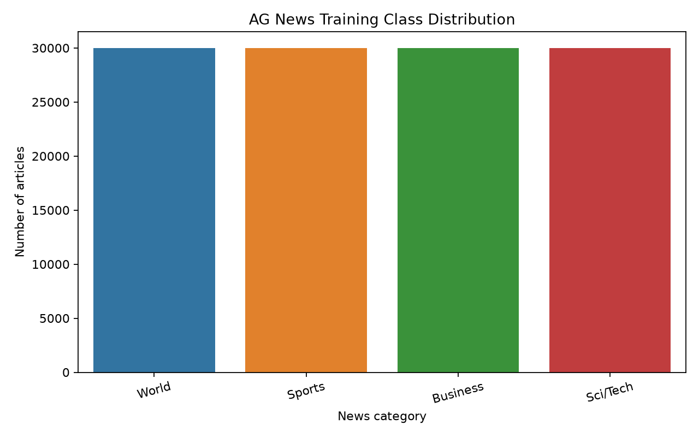
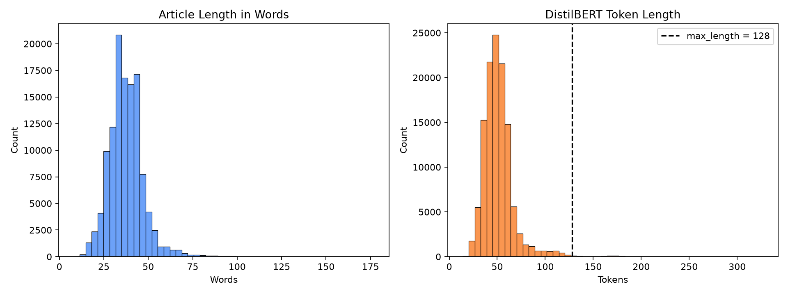
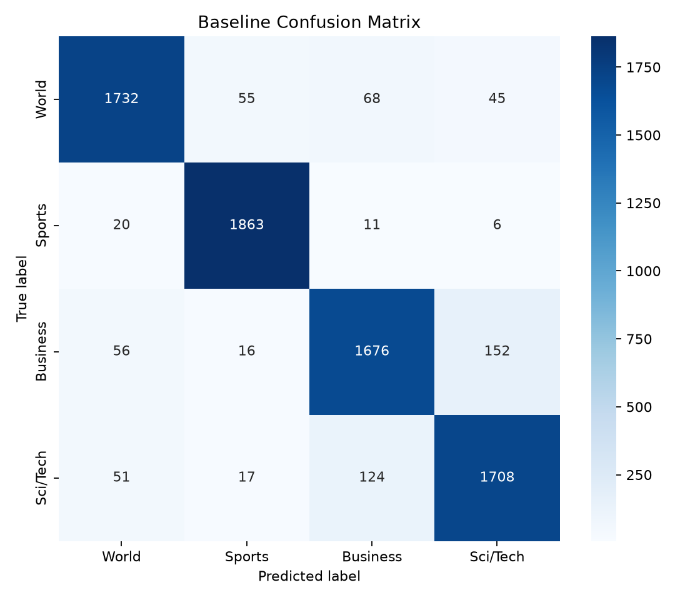
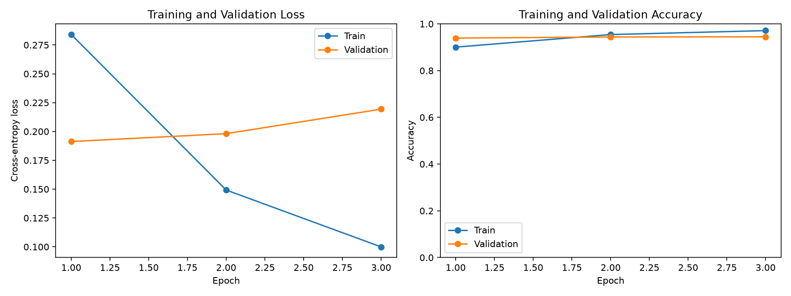
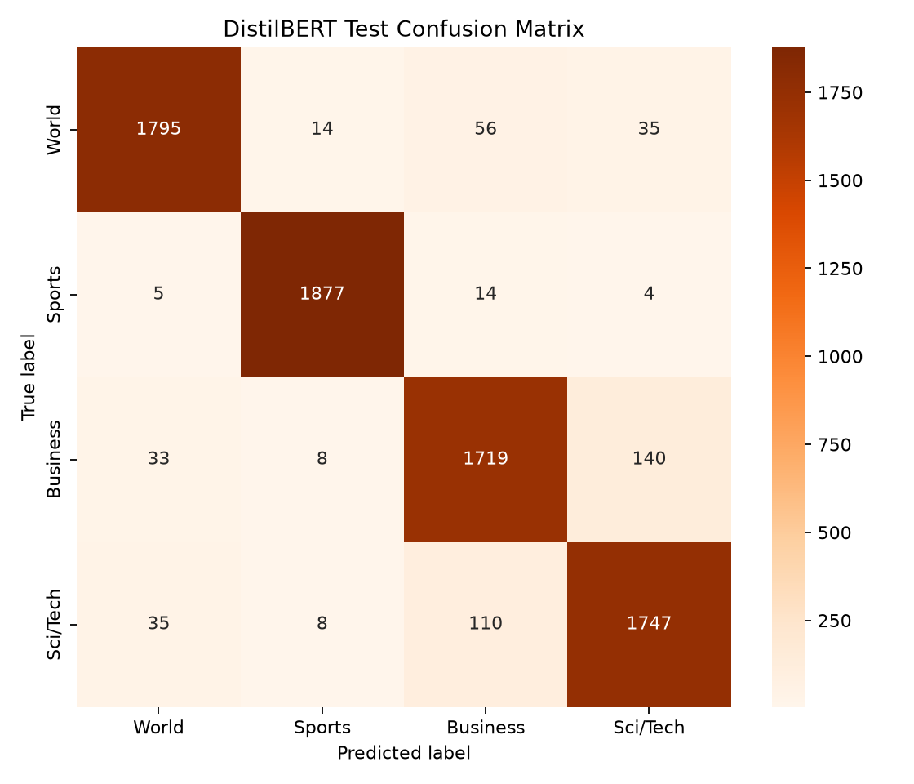
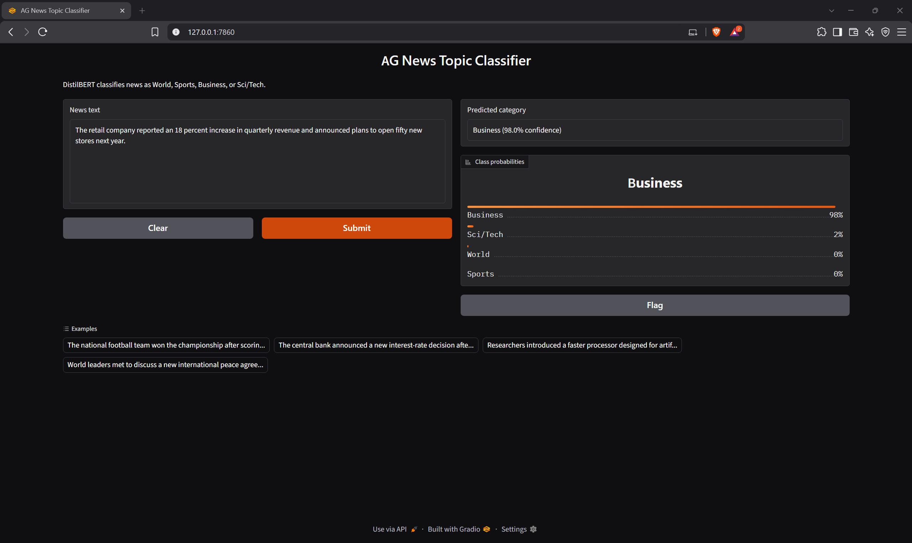
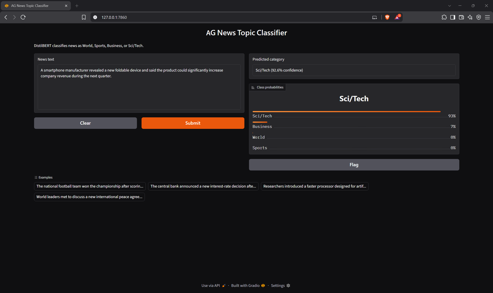
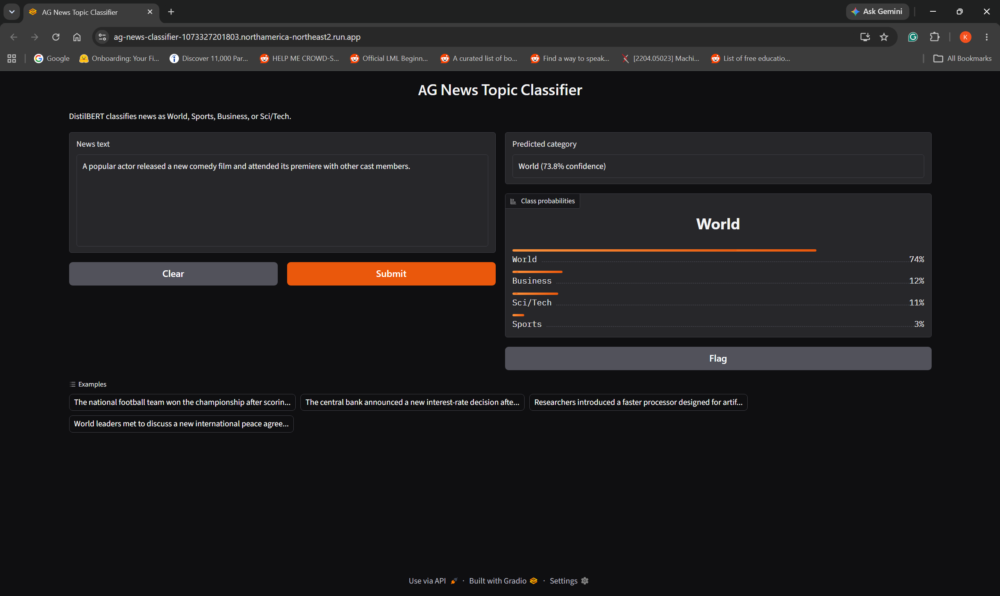

# AG News Topic Classification with DistilBERT

Final project for Natural Language Processing (AIG230NAA).

## Project overview

This project builds an end-to-end text classification system that assigns an
English news headline or short article to one of four AG News categories:

| Label ID | Category |
|---:|---|
| 0 | World |
| 1 | Sports |
| 2 | Business |
| 3 | Sci/Tech |

The project includes exploratory data analysis, preprocessing, a traditional
baseline, DistilBERT fine-tuning with a manually written PyTorch loop,
evaluation, error analysis, saved-model inference, and an interactive Gradio
application. Only the public AG News dataset is used; no synthetic training
data was added.

## Final results

The completed run used random seed 42. Small differences may occur if the model
is trained again on different hardware.

| Model | Test accuracy | Macro precision | Macro recall | Macro F1 | Weighted F1 |
|---|---:|---:|---:|---:|---:|
| TF-IDF + Logistic Regression | 91.83% | 91.81% | 91.83% | 91.81% | 91.81% |
| DistilBERT | **93.92%** | **93.94%** | **93.92%** | **93.93%** | **93.93%** |

DistilBERT improved test accuracy by **2.09 percentage points**. Incorrect
predictions decreased from 621 for the baseline to 462 for DistilBERT. This is
159 fewer mistakes and a **25.6% reduction in errors**.

### DistilBERT performance by class

| Class | Precision | Recall | F1-score | Test examples |
|---|---:|---:|---:|---:|
| World | 96.09% | 94.47% | 95.28% | 1,900 |
| Sports | 98.43% | 98.79% | 98.61% | 1,900 |
| Business | 90.52% | 90.47% | 90.50% | 1,900 |
| Sci/Tech | 90.71% | 91.95% | 91.32% | 1,900 |

Sports was the easiest category. Business and Sci/Tech were more difficult to
separate because technology-company articles frequently discuss products,
sales, revenue, markets, and investments.

## Project structure

```text
ag-news-transformer/
├── notebooks/
│   ├── 01_eda.ipynb
│   ├── 02_preprocessing_and_model.ipynb
│   ├── 03_baseline.ipynb
│   └── 04_training_evaluation_errors.ipynb
├── src/
│   ├── baseline.py
│   ├── config.py
│   ├── data_preprocessing.py
│   ├── eda.py
│   ├── evaluate.py
│   ├── model.py
│   ├── predict.py
│   ├── text_cleaning.py
│   └── train.py
├── models/
│   ├── baseline/
│   └── best_model/
├── outputs/
│   ├── figures/
│   ├── metrics/
│   └── screenshots/
├── .gitattributes
├── .gitignore
├── app.py
├── environment.yml
├── requirements.txt
├── run_pipeline.py
└── README.md
```

The Python modules contain the reusable full-dataset pipeline. The notebooks
use the same project functions and present the important results in an easier
format for explanation.

## Environment setup

Python 3.10 or 3.11 is recommended. Run all commands from the project root.

### Conda setup

```powershell
conda env create -f environment.yml
conda activate agnews-nlp
python -m ipykernel install --user --name agnews-nlp --display-name "agnews-nlp"
```

If the environment already exists:

```powershell
conda activate agnews-nlp
python -m pip install -r requirements.txt
```

### Virtual-environment alternative

```powershell
python -m venv .venv
.\.venv\Scripts\Activate.ps1
python -m pip install --upgrade pip
pip install -r requirements.txt
```

Verify PyTorch and GPU availability:

```powershell
python -c "import torch; print(torch.__version__); print(torch.cuda.is_available()); print(torch.cuda.get_device_name(0) if torch.cuda.is_available() else 'CPU')"
```

The first dataset and model run requires an internet connection to download AG
News and `distilbert-base-uncased`. After training, inference uses the locally
saved checkpoint and does not retrain the model.

## Recommended execution order

### 1. Exploratory data analysis

```powershell
python -m src.eda
```

### 2. Traditional baseline

```powershell
python -m src.baseline
```

### 3. Fine-tune DistilBERT

```powershell
python -m src.train --epochs 3 --batch-size 16 --learning-rate 2e-5 --max-length 128
```

The training script automatically uses CUDA when available. Reduce the batch
size to 8 if GPU memory is insufficient.

### 4. Evaluate the best checkpoint

```powershell
python -m src.evaluate
```

This evaluates the saved best checkpoint on the official test split. The test
labels are not used for training or checkpoint selection.

### 5. Open the notebooks

```powershell
jupyter lab
```

The four notebooks contain saved outputs for EDA, preprocessing, baseline
comparison, learning curves, evaluation, and representative errors.

### 6. Run the inference application

```powershell
python app.py
```

Open `http://127.0.0.1:7860`. The application displays the predicted category,
confidence score, and probabilities for all four classes.


### Optional Cloud Run deployment

As an optional extension beyond the course requirements, the saved-model
inference application was packaged with Docker and deployed to Google Cloud
Run:

**[Open the live AG News classifier](https://ag-news-classifier-1073327201803.northamerica-northeast2.run.app/)**

The deployment uses the same saved checkpoint as the local application and
does not retrain the model. It may take a short time to respond to the first
request after inactivity because the service scales down to zero when unused.
The hosted link is provided for demonstration and experimentation and may be
disabled after project assessment.

### Complete pipeline

```powershell
python run_pipeline.py
```

Completed stages can be skipped. For example:

```powershell
python run_pipeline.py --skip-eda --skip-baseline --skip-training
```

## Dataset exploration

AG News contains 120,000 original training articles and 7,600 official test
articles. Each original training class contains exactly 30,000 articles, so
class imbalance is not expected to bias the classifier.



Important EDA findings:

- No missing training or test text was found.
- The original training data contained 137 duplicate texts. They were removed
  before the train-validation split.
- Thirteen exact texts appeared in both original splits. This pre-existing
  overlap is a small dataset limitation, representing about 0.17% of the test
  set.
- The average article contained 37.68 words and 51.54 DistilBERT tokens.
- The median article contained 37 words and 49 tokens.
- The 95th percentile was 78 tokens and the 99th percentile was 116 tokens.
- A maximum length of 128 covers 99.441% of the training examples. Only 671
  unusually long examples require truncation.
- Approximately 81,398 distinct word forms were observed.
- Frequent terms included source names such as `Reuters` and `AP`, weekdays,
  and topic words such as `oil`, `company`, `president`, and `Iraq`.



The length analysis supports using `max_length=128`: it retains nearly all
articles while avoiding unnecessary padding and computation.

## Preprocessing decisions

### Light cleaning

The project repairs incomplete HTML forms such as `quot;`, `amp;`, and `#39;`,
decodes HTML characters, removes backslash artifacts, joins separated English
contractions, and normalizes repeated whitespace.

The text is not stemmed, lemmatized, or stripped of stop words. DistilBERT was
pretrained on natural sentences and uses word order and surrounding context,
so aggressive cleaning could remove useful information.

### Data splitting

After removing exact duplicates from the official training data, a stratified
90/10 split produces:

| Split | Rows |
|---|---:|
| Training | 107,876 |
| Validation | 11,987 |
| Test | 7,600 |

Stratification maintains approximately equal class proportions. The official
test labels remain separate until final evaluation.

### Transformer input

The DistilBERT tokenizer creates:

- `input_ids`: numerical token identifiers
- `attention_mask`: 1 for a real token and 0 for padding
- `labels`: class IDs from 0 through 3

Sequences are truncated at 128 tokens. Dynamic padding pads each batch only to
its longest sequence, reducing unnecessary computation.

## Baseline model

The baseline uses TF-IDF unigram and bigram features with Logistic Regression.
It achieved **91.83% test accuracy** and **91.81% macro F1**. Sports had the
highest baseline recall at **98.05%**, while Business and Sci/Tech were more
frequently confused.



This is a strong traditional baseline and provides evidence for deciding
whether the additional Transformer training cost is worthwhile. The fitted
vectorizer and Logistic Regression model are saved in `models/baseline/`.

## Why DistilBERT was selected

Training a Transformer from scratch would require a much larger text corpus,
more GPU time, and extensive tuning. DistilBERT has already learned general
English language patterns from pretraining, so this project only needs to
fine-tune that knowledge for the four AG News categories.

DistilBERT is also smaller and faster than full BERT while retaining contextual
language understanding. This makes it appropriate for a laptop GPU and for
interactive inference.

## Model architecture

```text
News text
  -> DistilBERT tokenizer
  -> input IDs and attention mask
  -> pretrained DistilBERT encoder
  -> first-token contextual representation
  -> dropout (0.30)
  -> linear classification layer (4 outputs)
  -> logits
  -> softmax probabilities during inference
```

The encoder creates contextual representations of the input. The new linear
layer learns one score for each category. Cross-entropy loss compares the four
logits with the correct label during training. During inference, softmax
converts the logits into class probabilities.

## Training pipeline

| Hyperparameter | Value | Reason |
|---|---:|---|
| Epochs | 3 | Enough to observe learning and possible overfitting |
| Batch size | 16 | Fits on the available laptop GPU |
| Learning rate | 2e-5 | Makes small updates to pretrained weights |
| Optimizer | AdamW | Common optimizer for Transformer fine-tuning |
| Weight decay | 0.01 | Provides mild regularization |
| Dropout | 0.30 | Reduces reliance on individual hidden features |
| Warmup ratio | 0.10 | Introduces the learning rate gradually |
| Gradient clipping | 1.0 | Limits unusually large gradient updates |

The manual PyTorch loop performs the forward pass, cross-entropy calculation,
backpropagation, gradient clipping, optimizer update, scheduler update,
validation, checkpointing, and early-stopping check.

Training three epochs on an **NVIDIA RTX 4070 Laptop GPU** took approximately
**23 minutes and 48 seconds**. This duration includes tokenization, training,
validation, checkpoint saving, and curve generation.

### Training and validation curves

| Epoch | Train loss | Validation loss | Train accuracy | Validation accuracy |
|---:|---:|---:|---:|---:|
| 1 | 0.2841 | **0.1913** | 90.06% | 93.93% |
| 2 | 0.1492 | 0.1981 | 95.44% | 94.40% |
| 3 | 0.0999 | 0.2194 | 97.12% | 94.47% |



Training loss continued to decrease, showing that the model learned the
training data. Validation loss was lowest in epoch 1 and then increased, while
validation accuracy improved only slightly. This indicates mild overfitting
and increasingly confident validation errors. The epoch-1 checkpoint was kept
because checkpoint selection used the lowest validation loss.

## Test evaluation

The saved epoch-1 checkpoint correctly classified **7,138 of 7,600** test
articles. Accuracy, macro precision, macro recall, macro F1, weighted F1, the
classification report, and the confusion matrix are saved in
`outputs/metrics/` and `outputs/figures/`.



Sports achieved the strongest recall at 98.79%. Business had the lowest recall
at 90.47%, mainly because of overlap with Sci/Tech.

## Error analysis

DistilBERT made 462 incorrect predictions. The two largest confusion directions
were:

- Business predicted as Sci/Tech: 140
- Sci/Tech predicted as Business: 110

Together, these account for 250 errors, or **54.11% of all mistakes**. Average
confidence on incorrect predictions was 80.17%, and 261 mistakes had confidence
of at least 80%. Error examples averaged 35.93 words compared with 37.55 words
across the full test set, so article length was not the main issue.

The evaluation script saves all 462 errors and creates `error_analysis_20.csv`
by sampling confusion pairs approximately in proportion to their frequency. It
also spreads the selection across the confidence range instead of selecting
only the most confident mistakes.

Evidence from the current 20-example review showed:

- Business articles about Linux, broadband, IBM, email, and vehicle technology
  were often predicted as Sci/Tech.
- Sci/Tech articles discussing gas prices, acquisitions, revenue, profit, or a
  chief financial officer were often predicted as Business.
- Some articles contained incomplete or unclear context.
- Several examples genuinely contained more than one topic.
- A small number appeared to have possible label ambiguity. For example, a Mars
  science story labelled World was predicted as Sci/Tech.

Possible improvements include reviewing ambiguous labels, adding more
mixed-topic training examples, calibrating confidence scores, comparing another
pretrained Transformer such as RoBERTa, and exploring multi-label
classification for articles that genuinely contain multiple topics.

## Saved-model inference

The final inference checkpoint is stored in `models/best_model/`:

- `encoder/model.safetensors`: fine-tuned DistilBERT encoder
- `encoder/config.json`: encoder configuration
- `classifier.pt`: four-class linear layer
- `tokenizer/`: saved tokenizer files
- `project_config.json`: labels, maximum length, hyperparameters, and checkpoint
  information

`app.py` loads these files once. For each new article, it performs cleaning,
tokenization, model inference, and softmax conversion without retraining.

### Inference examples

The first four examples are clear representatives of the four classes.
Predictions 5 through 7 mix vocabulary from multiple topics, while Predictions
8 and 9 demonstrate what happens when the input belongs to a topic that is not
part of the four-class label set.

#### Prediction 1: World

**Input:** International leaders signed a new peace agreement after several
days of negotiations aimed at ending the conflict between the two countries.


The model predicted **World with 97.8% confidence**.

#### Prediction 2: Sports

**Input:** The home team scored twice in the final ten minutes to win the
championship match and complete an undefeated season.


The model predicted **Sports with 99.7% confidence**.

#### Prediction 3: Business

**Input:** The retail company reported an 18 percent increase in quarterly
revenue and announced plans to open fifty new stores next year.



The model predicted **Business with 98.0% confidence**.

#### Prediction 4: Sci/Tech

**Input:** Researchers introduced a new artificial intelligence system that can
detect diseases from medical images faster than previous software.


The model predicted **Sci/Tech with 98.7% confidence**.

#### Prediction 5: Business and Sci/Tech overlap

**Input:** The software company launched a new cloud-based artificial
intelligence platform, causing its shares to rise after investors predicted
strong product sales.


The model predicted **Sci/Tech with 92.5% confidence**. Technical product words
had more influence than the references to shares, investors, and sales.

#### Prediction 6: Product and revenue overlap

**Input:** A smartphone manufacturer revealed a new foldable device and said
the product could significantly increase company revenue during the next
quarter.



The model predicted **Sci/Tech with 92.6% confidence**, while Business received
approximately 7%.

#### Prediction 7: World and Business overlap

**Input:** Several countries introduced new trade restrictions following a
political dispute, causing oil prices and international stock markets to fall.


The model predicted **Business with 96.4% confidence**, while World received
approximately 3%. Financial consequences became the strongest classification
signal.


## Out-of-scope text

This project uses **closed-set classification**. The model assumes that every
input belongs to one of the four available categories: World, Sports, Business,
or Sci/Tech. It does not contain Entertainment, Food/Lifestyle, `Other`, or
`Unknown` labels.

For every input, softmax distributes 100% probability among the four available
classes. Therefore, an unrelated article will still be assigned to whichever
available category appears most similar. A high confidence score does not
guarantee that the input belongs to the supported label set.

| Missing topic | Example text |
|---|---|
| Entertainment | A popular actor released a new comedy film and attended its premiere with other cast members. |
| Food/Lifestyle | A local chef demonstrated how to bake chocolate cake and shared several recipes for beginners. |

### Prediction 8: Entertainment article

**Input:** A popular actor released a new comedy film and attended its premiere
with other cast members.



The model predicted **World with 74% confidence**. The other probabilities were
Business 12%, Sci/Tech 11%, and Sports 3%. This is not a correct World
classification; it is the closest choice available to a model that has no
Entertainment class.

### Prediction 9: Food and lifestyle article

**Input:** A local chef demonstrated how to bake chocolate cake and shared
several recipes for beginners.


The model predicted **Sci/Tech with 47% confidence**. Business received 36%,
World 17%, and Sports approximately 0%. The lower confidence and divided
probabilities show that the input does not closely match one supported class,
but the model must still return one of the four labels.

These predictions should not be treated as valid topic assignments. Possible
future improvements include adding an `Other` class, applying a carefully
validated uncertainty threshold, or using out-of-distribution detection.

## Overall model conclusion

The DistilBERT model performed well, correctly classifying approximately 94 out
of every 100 test articles. It achieved **93.92% accuracy** and **93.93% macro
F1**, compared with **91.83% accuracy** for the TF-IDF baseline. DistilBERT made
159 fewer mistakes.

Its main limitation is separating Business and Sci/Tech when an article
contains information from both categories. Overall, the model is effective,
but mixed-topic and ambiguously labelled articles remain challenging.

## Git LFS and trained-model files

The required trained checkpoint includes a `model.safetensors` file of about
265 MB. The included `.gitattributes` file tracks this file with Git LFS so it
can be pushed to GitHub with the rest of the project.

Install and verify Git LFS before adding the model:

```powershell
git lfs install
git lfs track "models/best_model/encoder/model.safetensors"
git add .gitattributes
git lfs ls-files
```

The model weights, classifier, tokenizer, baseline models, figures, metrics,
and screenshots are intentionally not excluded by `.gitignore` because they
are part of the required submission.

## Submission checklist

- Complete source code in `src/`, `app.py`, and `run_pipeline.py`
- Four executed notebooks with saved outputs
- Fine-tuned model, classifier, tokenizer, and baseline model files
- Generated figures, metrics, and representative error tables
- README with environment, training, evaluation, and inference instructions
- Separate demonstration video

The demonstration video is intentionally kept separate from the Git repository
because video files are large. It should be submitted through the course system
or a shareable link, depending on the instructor's instructions.

## References

1. X. Zhang, J. Zhao, and Y. LeCun, “Character-level Convolutional Networks for
   Text Classification,” *Advances in Neural Information Processing Systems*,
   vol. 28, 2015.
2. V. Sanh, L. Debut, J. Chaumond, and T. Wolf, “DistilBERT, a distilled
   version of BERT: smaller, faster, cheaper and lighter,” arXiv:1910.01108,
   2019.
3. A. Vaswani et al., “Attention Is All You Need,” *Advances in Neural
   Information Processing Systems*, vol. 30, 2017.
4. Hugging Face, “AG News dataset card,”
   https://huggingface.co/datasets/fancyzhx/ag_news.
5. Hugging Face, “DistilBERT documentation,”
   https://huggingface.co/docs/transformers/model_doc/distilbert.

